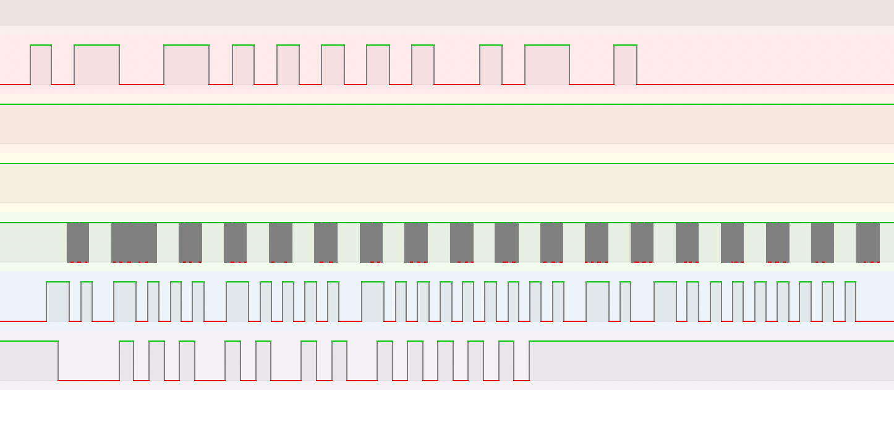

# Arduino-Inseparates
A component audio system communication library. 
Making your HiFi separates a little less separate.

## Overview

**Inseparates** is a library designed to bridge communication between IR, wired audio component interconnect protocols and IoT. It intends to be a complement and an extension to IR only libraries such as [IRMP](https://github.com/IRMP-org/IRMP), [Arduino-IRremote](https://github.com/Arduino-IRremote/Arduino-IRremote), and [IRremoteESP8266](https://github.com/crankyoldgit/IRremoteESP8266). While IR only libraries can have rudimentary suport for wired protocols by disabling IR modulation, Inseparates supports concurrent communication on multiple pins and wire only protocols, enabling simultaneous multi-bus communication with both IR and non-IR signals. 
Inseparates is though not focused on IR protocols and the above libraries can be used to extend the IR protocol support.

## Use Cases
* Integrate multi brand systems.
* IR to interconnect protocol translation.
* Enable extended functionality not available on IR protocols.
* Home automation integration.
* Wireless IR/wired message forwarding.
* DIY preamps/controllers.

## Features

- **Task-Based Cooperative Multitasking**: Inseparates uses a task-based cooperative multitasking model to handle concurrency, allowing simultaneous operations on multiple protocols. It supports both polled and interrupt-driven modes.
- **Multi Pin Protocol Support**: The protocols runs as independent tasks and can support multiple pin protocols like Technics System Control.
- **Device Support**: AVR, SAMD, ESP8266/ESP32.

The recommended device is ESP32, all other devices have limitations (or known bugs). 
ESP8266 only has one free timer, which can cause issues with other libraries. 
AVR and SAMD can currently only be used in polling mode. 
SAMD lacks hardware PWM implementation and tone() is useless on this platform.

The task based model is more resource-demanding than typical IR libraries and only a simple setups can run on AVR microcontrollers.

This shows output from the MQTT example where wired RC5, ESI and Sony signals were driven concurrently with an IRremoteESP8266 IR transmission:

The receivers were also active during this and mirrored the messages back to MQTT.

The blocking nature of IRremoteESP8266 send limits concurrency somewhat and concurrent interrupt based reception cannot currently be combined with IRremoteESP8266 receive.

## Supported Protocols

### Protocols

Inseparates supports a range of protocols used in consumer audio systems:

1. **Bang&Olufsen Datalink80**
   - Wire only protocol.

2. **Bang&Olufsen Datalink86**
   - Both the IR and wire version is supported.

3. **Bang&Olufsen Beo36**
   - The old 36 kHz pre 455 kHz IR only format.

4. **Philips RC5**
   - The same protocol is used both for IR and the RC5 bus.

5. **Philips ESI**
   - Wire only protocol.

6. **Sony SIRC**
   - The same protocol is used both for IR and the Control S bus.

7. **NEC**
   - Used both for IR and multiple wire standards e.g. Pioneer SR (System Remote).

8. **Technics System Control**
   - This is a two pin wire only protocol.

8. **RS232**
   - Serial communication.

**[Detailed protocol documentation](./docs/protocols.md)**

## Example Applications

### Simple Send

**[Example1_SendIR](./examples/Example1_SendIR)**

The smallest example, can be configured for both IR and wired send.

### Multi Receiver

**[Example2_MultiReceiver](./examples/Example2_MultiReceiver)**

Simultaneous reception on multiple pins.

### Send Receive

**[Example3_SendReceive](./examples/Example3_SendReceive)**

Simultaneous transmission and reception.

### Dual UART

**[Example4_DualFullDuplexSoftUART](./examples/Example4_DualFullDuplexSoftUART)**

Debug and stress test.

### Recevie Raw

**[Example5_ReceiveRaw](./examples/Example5_ReceiveRaw)**

Dump protocol timing.

### Collision

**[Example6_Collision](./examples/Example6_Collision)**

Wired protocol collision detection.

### Code Tester

**[Example7_CodeTester](./examples/Example7_CodeTester)**

Controls IR send with serial port to test IR commands.

### Datalink Display

**[Example8_DatalinkDisplay](./examples/Example8_DatalinkDisplay)**

Unfinished example that currently only prints to serial.

### MQTT / WebSocket / HTTP

**[Example9_MQTT](./examples/Example9_MQTT)**

MQTT client and WebSocket / HTTP server that supports both IR and wired protocols. 
Makes it possible to control your audio system from your home automation or by custom remote applications. 
Uses IRremoteESP8266 for extensive IR protocol support. 
Partially compatible with OpenMQTTGateway's regular JSON message structure. 
Supports enumeration and addressing so that you can have multiple clients around the house e.g. one in front of your equipment for IR and one behind for wired interconnects.

As the MQTT topics are configured now it is intended for using with e.g. a web application but by modifying the topics on different devices this example can be modified to forward messages without the need for anyting more than the MQTT server.

### RC5 Hairpin

**[Example10_IRremote_RC5Hairpin](./examples/Example10_IRremote_RC5Hairpin)**

This is used to control a Philips CD in a Yamaha system with a Yamaha system remote. 
Requires only a single RC5 connection to the CD player. 
Decodes Yamaha commands using the signal on the RC5 bus passed unprocessed from the IR eye. 
Sends back RC5 commands between repeat commands.

### Dual Frequency

**[Example11_IRremoteESP8266_DualFrequency](./examples/Example11_IRremoteESP8266_DualFrequency)**

This examples handles two IR receivers on different pins. 
When using both 455 kHz and standard IR frequencies the received signals cannot be combined on the same pin as the signals would interfere as both may produce output as the same time with different timing. 
Uses IRremoteESP8266 for the low frequency IR decoding.

### Technics System Control

Shows IRMP integration by translating remote commands to the Technics System Control bus. 

**[Example12_IRMP_TechnicsSystemControl](./examples/Example12_IRMP_TechnicsSystemControl)**

## Debugging and Testing

Debugging cooperative multitasking can be challenging. To make this somewhat easier the tests has been extended with an exacutable that can be debugged on host. See the debugging documentation:

**[Debugging and testing documentation](./docs/debugging.md)**

## Installation and Usage

- Clone this repository into your Arduino/libraries folder.
- SAMD support requires the SAMDTimerInterrupt library.
- Testing and debugging on host also requires CMake.
- Some of the examples also use these additional libraries
	- IRMP
	- Arduino-IRremote
	- IRremoteESP8266
	- WiFiManager
	- PubSubClient
	- ArduinoJson

## Contributing

Contributions are welcome.

## License

This project is licensed under the MIT License. See the [LICENSE](./LICENSE) file for details.

## Disclaimer
This project is an independent effort and is not affiliated with, endorsed by, or associated with any of the trademarks, brands, or companies mentioned in the documentation or source code. All product names, logos and brands are properties of their respective owners. Use of these names, trademarks, and brands is for informational and descriptive purposes only and does not imply any association, endorsement, or partnership.

### Additional Documentation Links

- [Protocol Documentation](./docs/protocols.md)
- [Debugging Guide](./docs/debugging.md)
