# Supported Protocols in Inseparates

## Overview

Inseparates provides support for a few IR protocols as well as some wire only protocols commonly used in consumer audio equipment. This documents the protocols that are undocumented elsewhere.

### Bang&Olufsen Datalink80

**[ProtocolDatalink80.h](../src/ProtocolDatalink80.h)**

This protocol superficially looks like 320 baud RS232 with no parity, 7 data bits and 8 stop bits but it likely is not and instead has the MSB first and the bits inverted because that makes numbers sent over this protocol behave as they should.

Messages are always sent twice.

This is an active low protocol. See the hardware section below.

### Bang&Olufsen Datalink86

**[ProtocolDatalink86.h](../src/ProtocolDatalink86.h)**

Almost the same protocol is used both for IR and the wired Datalink connections but they differ in timing. 
A description of the protocol can be found here:
**[Datalink](https://www.mikrocontroller.net/attachment/33137/datalink.pdf)**

IR is sent with an unusual 455 kHz modulation and this requires a special receiver. See the hardware section below.

This is an active low protocol. See the hardware section below.

### Bang&Olufsen Beo36

**[ProtocolBeo36.h](../src/ProtocolBeo36.h)**

There is no known documentation of this protocol. 
The implementation here is based on reverse engineering of a TV remote. 

This is a six bit 36 kHz modulated IR only protocol.

Largely useless today. Implemented to complement the other B&O protocols.

### Philips RC5

**[ProtocolRC5.h](../src/ProtocolRC5.h)**

The same protocol is used both for IR and the wired RC5 bus. 
A description of the protocol can be found here:
**[RC5](https://www.sbprojects.net/knowledge/ir/rc5.php)** 

The wired version is unmodulated and 5V _active high_. See the warnings in the hardware section below.

### Philips ESI

**[ProtocolESI.h](../src/ProtocolESI.h)**

This is a wired only, unmodulated and 5V _active high_ protocol. See the warnings in the hardware section below.

There is no known documentation of this protocol. 
The implementation here is based on reverse engineering. 
The message format has been decoded but the meaning of the messages sent on this bus is mostly unknown. Only a few have been decoded. See the header file above. 
Philips devices with both ESI and RC5 connectors have functionality that can only be controlled with the ESI bus. It is for example impossible to remotely set the source of amplifiers without using the ESI bus.

**20 bits**: 
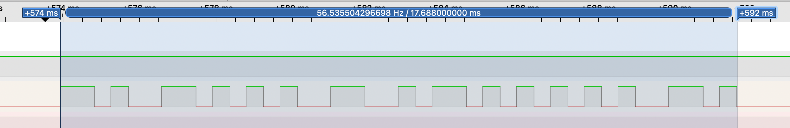

**28 bits**: 
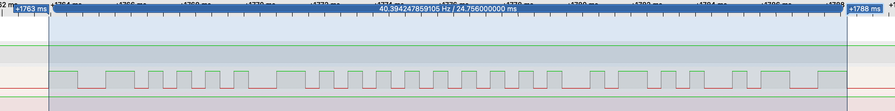

**36 bits**: 
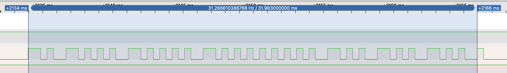

### Sony SIRC

**[ProtocolSIRC.h](../src/ProtocolSIRC.h)**

The same protocol is used both for IR and the wired CONTROL S bus. 
A description of the protocol can be found here:
**[SIRC](https://www.sbprojects.net/knowledge/ir/sirc.php)**

The wired version is unmodulated and active low. See the hardware section below.

Note that the CONTROL S connector has four pins. 
One of these is supply voltage through a resistor, so be careful. 
For communication, you only need to connect the ground and signal pin.

### NEC

**[ProtocolNEC.h](../src/ProtocolNEC.h)**

The same protocol is used both for IR and the wired versions. 
A description of the protocol can be found here:
**[NEC](https://www.sbprojects.net/knowledge/ir/nec.php)**

**Wired Variants**

- Pioneer SR (System Remote) 
Unmodulated and active low.
- Other 
Likely unmodulated and active low. Consult service manual to make sure.

### Technics System Control

**[ProtocolTechnicsSC.h](../src/ProtocolTechnicsSC.h)**

There is no known documentation of this protocol. 
The implementation here is based on reverse engineering. 
The message structure has been decoded but the meaning of the messages sent on this bus is mostly unknown. Only a few have been decoded. See the header file above.

There may be more than one version of this protocol. The protocol implemented here was reverse engineered on ST-X902L / ST-X302L tuners.

This is a two pin active-low protocol and there is a handshake mechanism to support multi master communication without collision.

Data is tip of a 3.5mm TRS connector. 
Clock is ring of a 3.5mm TRS connector.

**Single master**: 
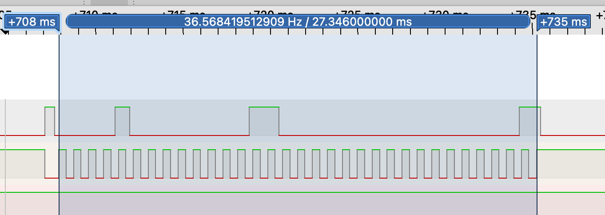

**Multi master**: 
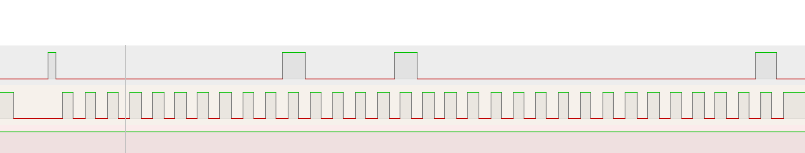

### RS232

**[ProtocolUART.h](../src/ProtocolUART.h)**

Full duplex software UART. Can only be used at low speeds, but can be used concurrently with other protocols.

## Hardware

The information below may not be accurate for all equipment out there. If you want to be sure, consult the service manual. This is especially true for protocols with custom connectors like Sony Control S.

More or less any small signal bipolar transistor should work in the schematics below.

### IR receivers

Some receivers have push-pull outputs and some are open-drain. The schematic below is safe for anything from your drawer even if you don't have a 5V tolerant MCU.

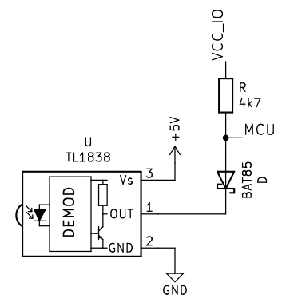

### 455 kHz IR receivers
The only 455 kHz IR receivers available today are counterfeit TSOP7000:
**[CounterfeitTSOP7000](https://www.vishay.com/files/new-products/doc/ff_FastFacts_CounterfeitTSOP7000_Dec72018.pdf)** 
These suck. The output must be filtered and buffered as shown below and even then they are not completely reliable.
The pull-up in the schematic below can be omitted if there's an internal pull-up in the MCU.

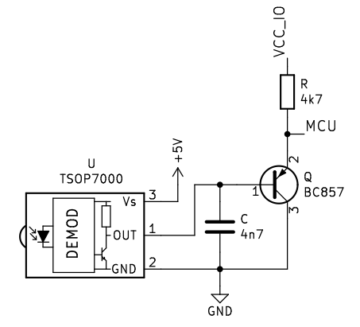

### Active Low Protocols

Most wired protocols are active low and bidirectional: Mark is driven low and space is pull-up. 
The adventurous can connect these protocols directly to an active low open-drain MCU pin. This is though not recommended ever and really not recommended on non 5V tolerant devices. Even if you avoid hot plugging there can be high voltages present between equipment that can kill your MCU.

The simple single transistor connection used in Bang&Olufsen equipment is the preferred way to connect these interconnects to an MCU and this is safe regardless of MCU I/O voltage.

The schematics below are bidirectional even if it doesn't look like that. A bipolar transistor can be used "upside down" too, it will just have worse performance.

**Minimum safeish hardware**: You can get away with this if you only have a single connection and no ground loops.

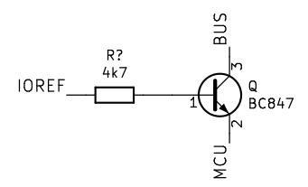

**Recommended hardware**: Limits ground currents, EMI and overvoltages.

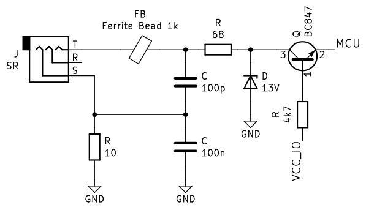

### Active High Protocols
For some unfathomable reason a few wired protocols use a connector type where a 5V idle would not be a good idea. Most notably Philips RC5 and ESI. On these mark is driven high and space is pull-down. 
This effectively connects the 5V supplies of equipments when they happen to send simultaneously, unless they have current limiting resistors, which some implementations lack. 
As with the active low protocols the adventurous can connect these protocols directly to an _active high_ open-drain MCU pin. But this is even less recommended as an active transmission will try to supply the MCU through the pin protection diodes (depending on how this protection is implemented). 

The standard hardware used in Philips equipment uses two transistors and two MCU pins. If an active high open-drain MCU pin is available this can be done both safer and easier (making this standard almost sane):

BAT85 gives a bit more margin than 1N4148 if the MCU isn't using a 5V supply.

Note that if this is connected to a pin of an MCU with a lower than 5V supply there is a high impedance path that elevates the connected pin above the supply voltage during transmissions. But it would require an exceedingly sensitive device to be harmed by this.

**Minimum safeish hardware**: You can get away with this if you only have a single connection and no ground loops (and either have a pin with internal pull-down or don't care about floating inputs).

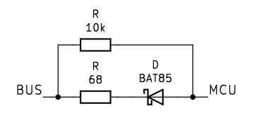

**Recommended hardware**: Limits ground currents and EMI.

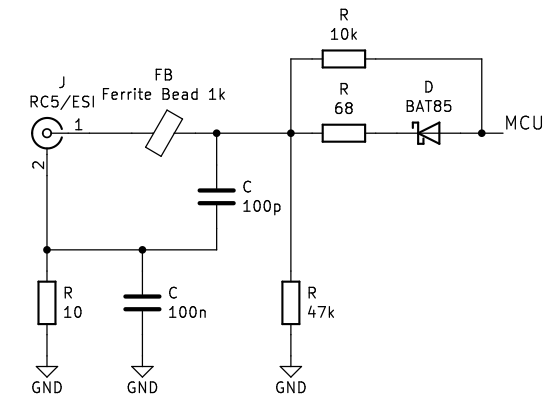

**[Back to Main Documentation](../README.md)**
